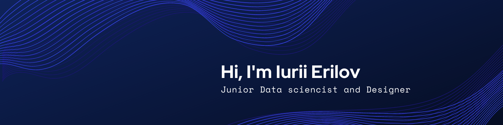

## Hi there 👋

I'm Iurii, a young **Data Scientist** and **Designer** 
* have experience working with  **ML, DL, Time Series, NLP, CV, Audio**
* have **designing, management skills of project** (Software engineering at FEFU)
* know graphic design
* studying high maths 

I develop various models for practical purposes and also quite often participate in professional activities.

## More about me

I am studying software engineering at fefu, completed **Deep Learning School**, as well as courses at **Coursera**.
Now I participate in hackathons to develop my **hard** and **soft skills**.

## :trophy: GitHub Profile Trophy

## &#x1f4c8; GitHub Stats

 

 

## 💼 Skills

More Skills

 

 

